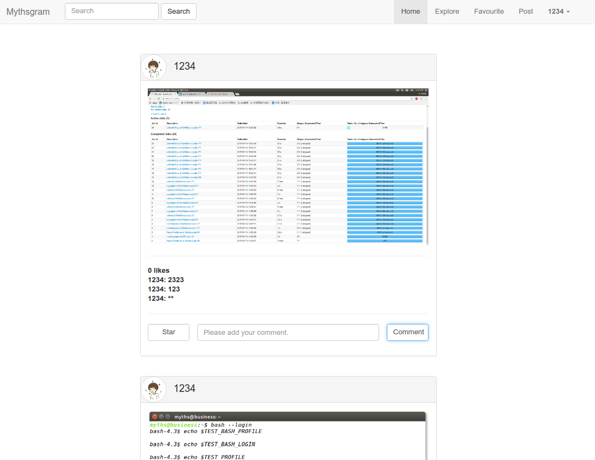
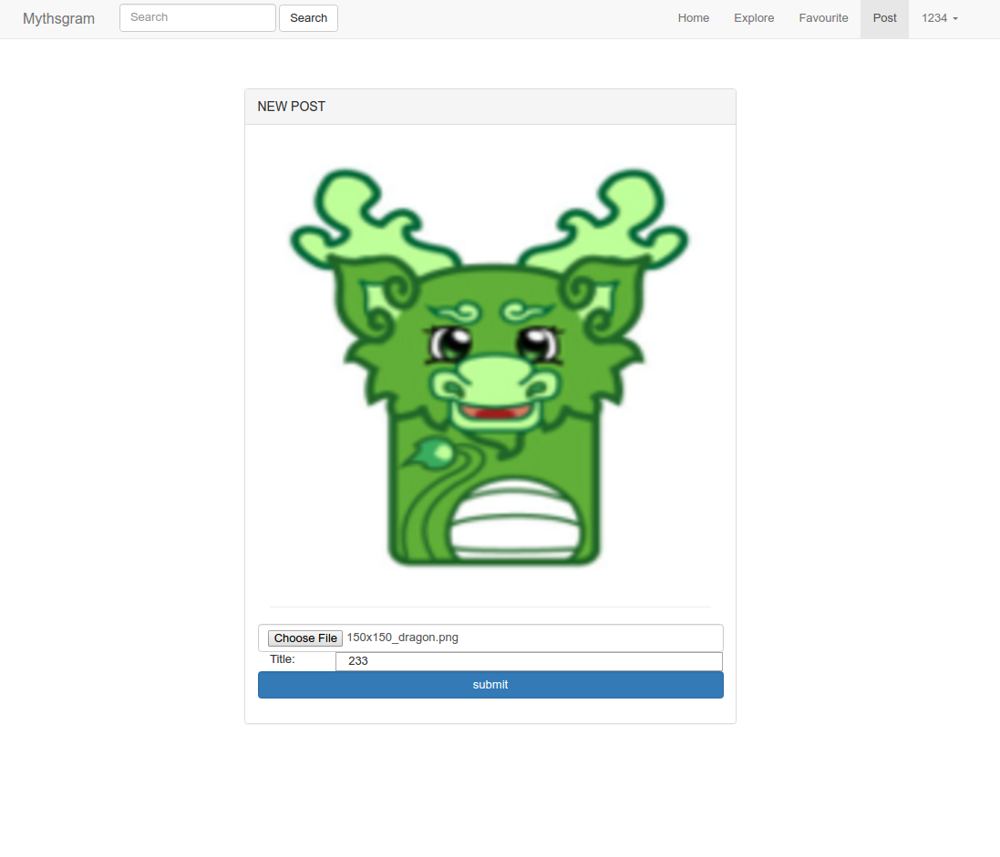
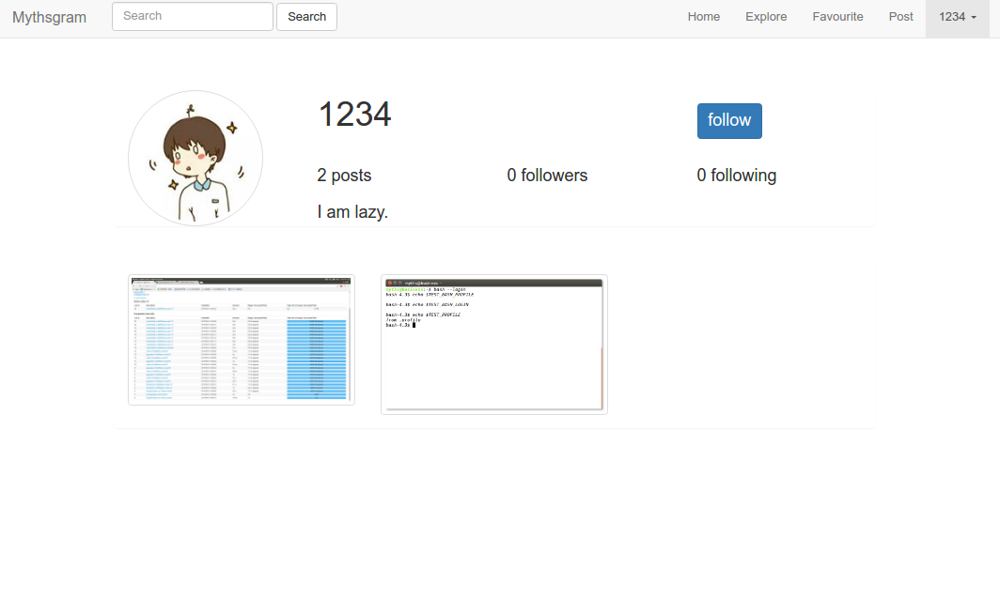
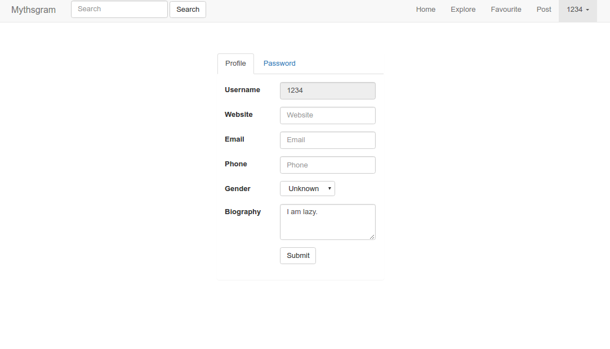
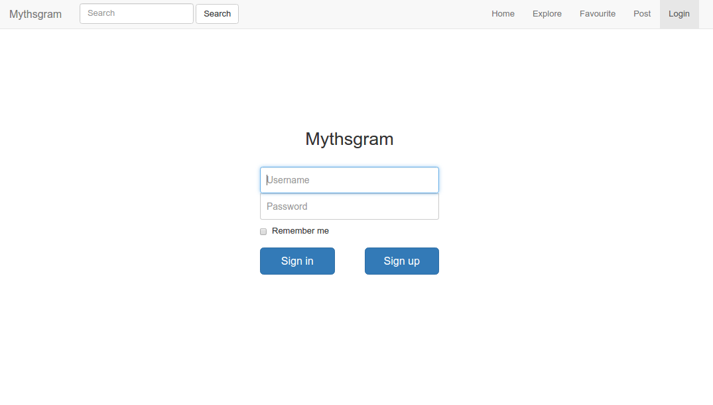

# Mythsgram

## Introduction
A simple project for [Instagram](https://www.instagram.com) , using SpringBoot structure.

## Function
* Login and logout.
* Profile update.
* Sensitive word filter.
* Picture upload , size limit ,type limit.
* Comment and star record with redis.
* Responsive layout.
* Anti script injection.

## Todo
* Solr search.
* Explore module.
* Mail module with asynchronous design.
* Timeline using.

## Screenshot

## References
[bootstrap3](http://v3.bootcss.com/)

[Thymeleaf](http://www.thymeleaf.org/doc/tutorials/2.1/usingthymeleaf.html)

[Instagram](https://www.instagram.com)

[SpringBoot](http://docs.spring.io/spring-boot/docs/1.5.3.RELEASE/reference/htmlsingle/)

[SpringBoot-aop](https://docs.spring.io/spring/docs/current/spring-framework-reference/html/aop.html)